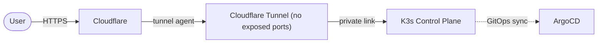

# Secure-K3s-GitOps-Template


> **TEMPLATE REPOSITORY** — click **Use this template** to start. Day-to-prod path below; commercial Starter Pack deliverables in [`docs/starter-pack-deliverables.md`](docs/starter-pack-deliverables.md).

Vendor-grade, secure-by-default K3s reference by **Ranas Security** ([run-as-daemon.dev](https://run-as-daemon.dev)). Bootstrap a Zero Trust cluster: no exposed ports, Cloudflare Tunnel ingress, GitOps with ArgoCD.

## Day-to-prod

| Step | Action |
|------|--------|
| 1. Prerequisites | `kubectl`, `terraform` ≥ 1.6, `ansible` (recommended), `helm`, Cloudflare + Hetzner (or adapt Terraform) |
| 2. Template | **Use this template** → private repo recommended |
| 3. Secrets | `cp .env.example .env` and fill tokens (`.env` is gitignored) |
| 4. Bootstrap | `./bootstrap.sh` — validates deps, `terraform init` |
| 5. Install | `make install` |
| 6. Deploy | `make deploy` → push Git → ArgoCD reconciles `cluster/` |
| 7. Verify | Tunnel up; no public kube-api/SSH; apps healthy |
| 8. Gate + audit | See [Security tooling](#security-tooling-gate--audit) |

Longer notes: [`docs/day-to-prod.md`](docs/day-to-prod.md).

```bash
cp .env.example .env   # edit secrets
./bootstrap.sh
make install
make deploy
```

## Security tooling (gate + audit)

| Tool | Role | Link |
|------|------|------|
| **k8s-security-gate** | CI: fail on CRITICAL/HIGH manifest findings | [repo](https://github.com/ranas-mukminov/k8s-security-gate) · copy [`examples/ci/k8s-security-gate.yml`](examples/ci/k8s-security-gate.yml) → `.github/workflows/` when you add cluster YAML |
| **Kube-Simple-Audit** | Runtime one-liner + Markdown report | [repo](https://github.com/ranas-mukminov/Kube-Simple-Audit) |

```bash
# Runtime sanity check (needs kubectl + jq)
curl -fsSL https://raw.githubusercontent.com/ranas-mukminov/Kube-Simple-Audit/main/audit.sh | bash -s -- --markdown
```

> Workflow files are shipped under `examples/ci/` so empty template trees do not break Actions, and so PRs do not require the GitHub `workflow` OAuth scope. Copy into `.github/workflows/` when ready.

## Why this exists

- **Zero Trust:** no direct SSH, no public kube-api; ingress via Cloudflare Tunnel.
- **GitOps-first:** declarative state reconciled by ArgoCD.
- **Opinionated security:** CIS-inspired Ansible hardening + locked-down Terraform defaults.

## Repository layout

```
.
├─ examples/ci/              # Copy-paste workflows (security gate)
├─ docs/                     # Day-to-prod + commercial deliverables one-pager
├─ cluster/                  # ArgoCD app-of-apps + Kubernetes manifests
├─ infrastructure/
│  ├─ ansible/               # K3s host hardening playbooks
│  └─ terraform/             # IaC for Hetzner/DO
├─ scripts/                  # Helper utilities
├─ .env.example              # Documented secrets (no real values)
├─ bootstrap.sh              # One-time bootstrap entrypoint
└─ Makefile                  # Common tasks
```

## Architecture (Zero Trust ingress)



## Commercial Starter Pack

OSS template is free (MIT). For guided onboarding, SLA hypercare, and a written remediation pack, see **[`docs/starter-pack-deliverables.md`](docs/starter-pack-deliverables.md)** (A5 one-pager).

- CTA: [Express Audit + Hardening](https://run-as-daemon.dev/en/services/express-audit-hardening.html) · [Telegram](https://t.me/run_as_daemon_dev) · [Book a call](https://calendly.com/aleksandrranas/new-meeting)

## Contributing

Issues and PRs welcome. Keep Zero Trust assumptions — no new public ingress, no unmanaged cluster mutations.

## License

MIT. See `LICENSE`.
